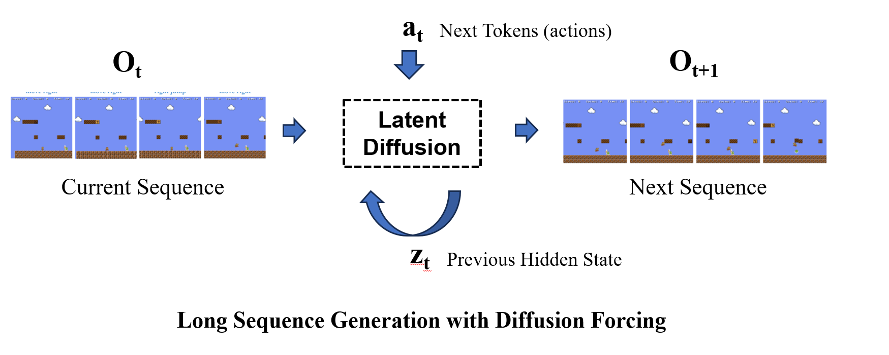
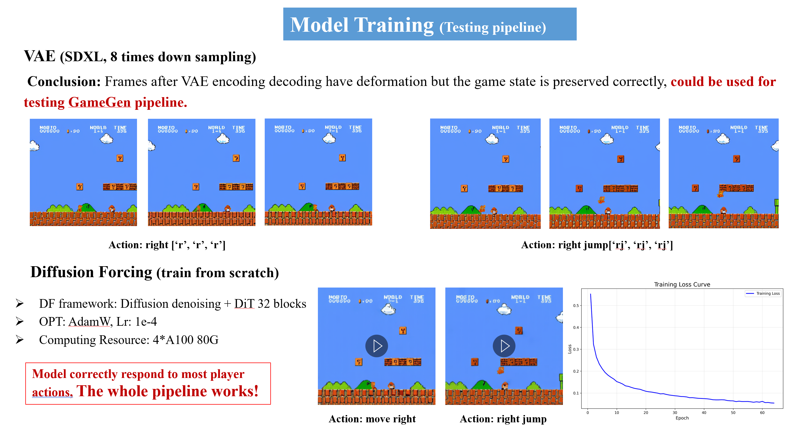

<h1 align="center">🎮 Learning to Play 🎮</h1>
<p align="center">
A generative AI framework for game learning and interactive world creation
</p>
<hr>




> **Note**: This project is based on the [Playable Game Generation](https://github.com/GreatX3/Playable-Game-Generation) framework by GreatX3.

### ⭐️ Introduction  

We built and trained a generative game model that combines a **VAE** with a **Diffusion-Forcing** architecture enhanced by **recurrent-style hidden states** for **long-horizon temporal coherence**. This project began in August 2025, leveraging both real player gameplay and AI-agent trajectories to collect over 100,000 Super Mario gameplay frames, significantly improving temporal memory, action consistency, and generalization capability across diverse game scenes.  
➡️ [Hugging Face Dataset: mario_data](https://huggingface.co/datasets/FeiyanZhou/mario_data)

- ✅ Real-time generation: **16 FPS**
- 🎮 Continuous gameplay generation: **>2 minutes**
- 🧠 Architecture: Diffusion-Forcing + Memory + SDXL-VAE (×8 latent downsampling)

> Some small objects (Mario, Goombas) appear slightly blurry due to the ×8 latent compression in the SDXL-VAE. We are actively enlarging the dataset and refining trajectories to enhance detail fidelity and complex action reproduction.

# 📹 Demo Display

<div align="center">

### 🎬 Short Sequence (36 frames)


### 🕒 Long Sequence Rollout (1min30s)


</div>

# 🏭 Environment Setup

Set up the environment, and install dependencies:
```
pip install -r requirements.txt
```
Before starting, you need to set the running device in the configuration file. The default is `device = "cuda:0"`.

# 🚀 Model Training

## VAE Training
Use `trainVAE.py` to train the VAE model:
```
python trainVAE.py
```

## Diffusion DiT Training
Use `train.py` to train the Diffusion DiT model:
```
python train.py
```

# 🔮 Model Inference

Use `infer_test.py` for model inference:
```
python infer_test.py -i 'eval_data/demo1.png' -a r,r,r,r,r,r
```

## Parameters:
- `-i`: Input image path (e.g., `eval_data/demo1.png`)
- `-a`: Action sequence for each frame, separated by commas

## Available Actions:
- `l`: Move left
- `r`: Move right  
- `j`: Jump
- `f`: Fire
- `lj`: Left jump
- `rj`: Right jump
- `n`: No action (null)

After inference is complete, the generated game content will be saved in the output directory.

# 📋 Project Status



This project is currently under active development. The following components are being implemented:

## 🚧 In Progress

1. **PPO Policy AI Agent Training**: Implementing Proximal Policy Optimization algorithms for intelligent agent behavior learning and large-scale data collection
2. **VAE Model Enhancement**: Optimizing Variational Autoencoder architecture to improve image encoding and decoding quality
3. **Large-scale Diffusion Model Training**: Loading extensive datasets to train robust diffusion models for high-quality game content generation

## 🔄 Development Pipeline

- **Data Collection**: Automated gameplay data gathering through AI agent interactions
- **Model Optimization**: Continuous improvement of VAE and Diffusion DiT architectures
- **Performance Evaluation**: Comprehensive testing and validation of generated content quality
